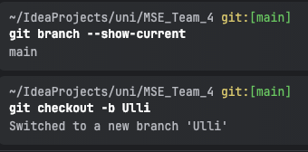
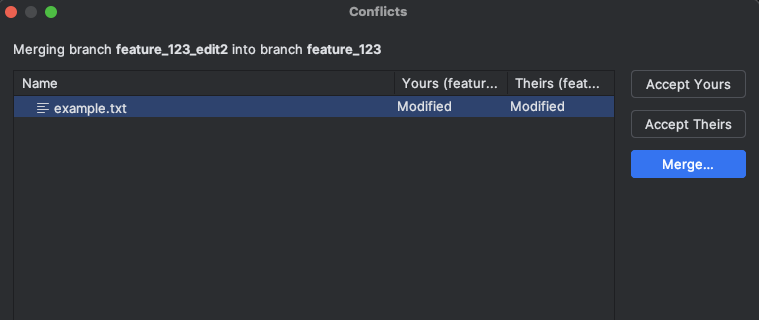
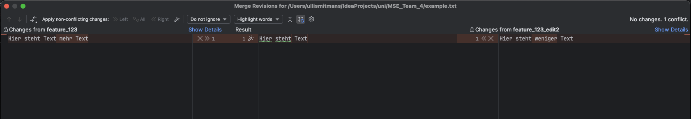
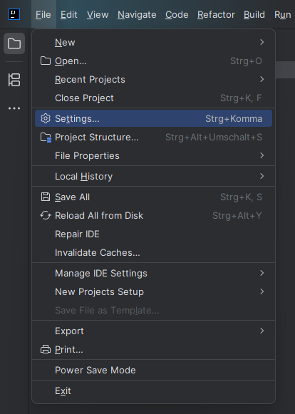
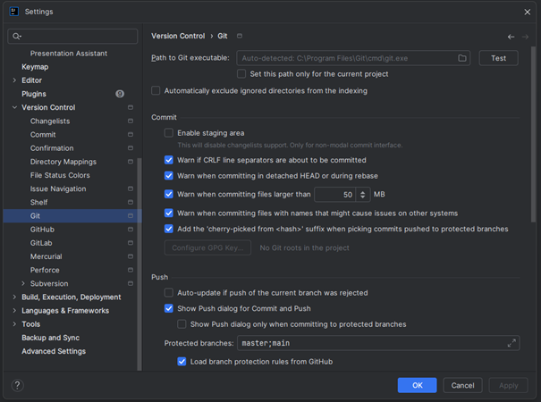
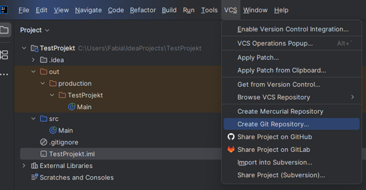
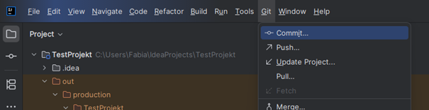
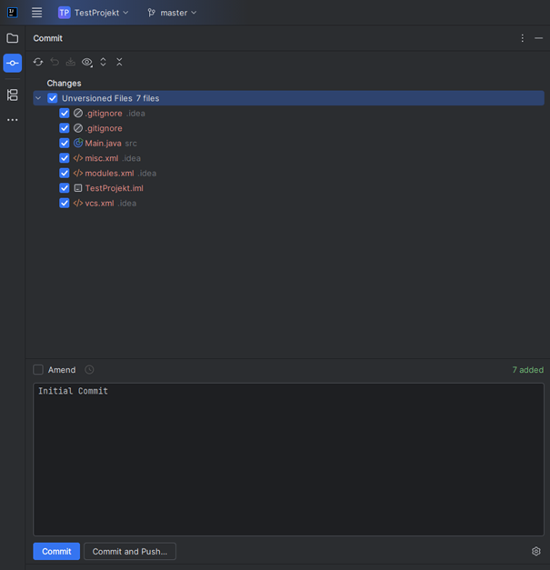

# EA1 Grundlagen Git

## Was ist Git und warum sollte es verwendet werden? (Lydia Boes)
Git ist ein verteiltes Versionskontrollsystem (= Distributed Version Control System). Mithilfe von Git ist es möglich, Änderungen an Softwareprojekten (z.B. an Quellcode oder Dateien) zu verfolgen und nachzuvollziehen. Zum Beispiel lassen sich damit die folgenden Fragen beantworten:
- Wer hat etwas geändert?
- Wann wurde etwas geändert?
- Was wurde geändert?
- Wo wurde etwas geändert?
- Warum wurde etwas geändert?

Git bietet die Möglichkeit mit mehreren Entwicklern gleichzeitig am selben Softwareprojekt zu arbeiten. Auf dieser Grundlage sind die Entwickler in der Lage zwischen verschiedenen Versionen zu wechseln oder eigene Versionen mit denen der Teammitglieder zusammenzuführen (mergen).

Heutzutage gilt Git als Standard in der Softwareentwicklung. 

## Grundlegende Git-Befehle (z. B. git init, git add, git commit, git push) 
[Git-Befehle.pdf](https://github.com/user-attachments/files/22888931/Git-Befehle.pdf)
Malinda Riebenstahl

| Git-Befehl | Description / Erklärung |
| --- | --- |
|$ git help add	| Öffnet die Browser-Dokumentation für den Befehl add als HTML.|
|$ git init	| Erstellt im aktuellen Verzeichnis ein neues Git-Repository; alle nötigen Dateien unter .git werden angelegt.|
|$ git init mydir	| Erstellt ein neues Verzeichnis mydir und initialisiert dort ein Git-Repository. |
|$ git clone httpsLink | Erstellt eine lokale Kopie eines entfernten Repositories. |
|$ git status	| Zeigt den aktuellen Status des Repositories: welche Dateien geändert, gestaged oder untracked sind. |
|$ git commit	| Speichert alle Änderungen, die gestagt wurden als einen neuen Commit im lokalen Repository. |
|$ git diff | Unterschiede zwischen Arbeitsverzeichnis und Staging (nicht gestagte Änderungen) werden aufgezeigt. |
|$ git diff --cached	| Unterschiede zwischen Staging und letztem Commit (bereit zum Commit) werden gezeigt. |
|$ git diff HEAD	| Unterschiede zwischen Arbeitsverzeichnis und letztem Commit werden gezeigt. |
|$ git add file(s)	| Fügt einzelne Dateien dem Staging hinzu. |
|$ git add README.md	| Fügt die Datei README.md dem Staging hinzu. |
|$ git add *.java	| Fügt alle .java-Dateien dem Staging hinzu. |
|$ git add SecretFolder |	Fügt den gesamten Ordner SecretFolder rekursiv dem Staging hinzu. |
|$ git add .	| Fügt im aktuellen Verzeichnis alle neuen bzw. geänderten Dateien dem Staging hinzu. |
|$ git commit -a -m "Nachricht"	| Erstellt einen Commit aller geänderten Dateien (ohne neue Dateien) mit einer Nachricht. |
|$ git push <repository>	| Auf das entfernte Repository werden alle lokalen Commits übertragen. |
|$ git pull --rebase <remote> <branch>	| Änderungen werden vom Remote-Repository gezogen und in den aktuellen Branch eingefügt, dabei werden lokale Commits "neu angewendet" (Rebase).|
|$ git rm useless.md	| Entfernt die Datei useless.md aus dem Arbeitsverzeichnis und dem Staging-Bereich. |
|$ git log	| Commit-History des aktuellen Branches wird angezeigt.|
|$ git log -p [-2]	| Commit-Historie wird angezeigt sowie die Änderungen (Patch); optional nur die letzten 2 Commits.|
|$ git branch	| Zeigt bzw. listet alle lokalen Branches auf. |
|$ git branch <branch name>	| Erstellt einen neuen Branch mit dem angegebenen Namen.|
|$ git checkout -b <branch name>	| Erstellt einen neuen Branch und wechselt sofort zu diesem Branch.|
|$ git branch -d <branch name>	| Löscht den angegebenen Branch lokal.|


## Branches und ihre Nutzung, Umgang mit Merge-Konflikten (Ulli Smitmans)

Damit Teammitglieder in der Softwareentwicklung gleichzeitig, aber unabhängig voneinander arbeiten können,  
ohne sich gegenseitig zu behindern, wird in Versionsverwaltungssystemen wie **Git** mit **Branches** gearbeitet.

Ein **Branch** ist eine Abzweigung von einem bestimmten Zustand des Repositories (also der Projektdateien) zu einem bestimmten Zeitpunkt.  
Wenn beispielsweise ein neuer Branch `feature_123` von dem Branch `development` abzweigt, übernimmt `feature_123` den aktuellen Stand des Repositories von `development`.

---

### 🔧 Beispiel: Arbeiten mit Branches

1. **Überprüfen, auf welchem Branch du dich befindest:**
   ```shell git branch --show-current```

2. Neuen Branch 'Ulli' erstellen und direkt wechseln:
   ```git checkout -b Ulli```

3. Unterschiede zwischen Branches anzeigen lassen:
   ```git diff main```

Keine Ausgabe bedeutet: keine Unterschiede.




### Simuliertes Beispiel mit mehreren Entwicklern

Um das oben genannte Beispiel umzusetzen, wird der Branch `feature_123` als Quellbranch genutzt.
Auf diesem Branch wird eine einfache Textdatei mit einem Satz erstellt.

Nun simulieren wir die Weiterentwicklung durch zwei Entwickler.
Diese erstellen sich jeweils eigene Branches:

`feature_123_edit_1`

`feature_123_edit_2`

In beiden Branches wird dieselbe Textdatei verändert.
Wenn nun beide Branches per Merge Request (MR) oder Pull Request (PR) wieder in den ursprünglichen Branch `feature_123` gemergt werden sollen,
erscheint eine Merge-Conflict-Warnung.




### Merge-Konflikte verstehen

Ein Merge Conflict bedeutet, dass dieselbe Datei im Zielbranch (`feature_123`) bereits verändert wurde,
und Git nicht automatisch entscheiden kann, welche Version korrekt ist.

In diesem Fall müssen die Entwickler den Konflikt manuell lösen — also festlegen,
welcher Inhalt der Datei im finalen Merge bestehen bleiben soll.




## Git mit IntelliJ/PyCharm benutzen: Local Repository und Remote Repository (Fabian Schmitz)
1. **Git muss auf dem Rechner installiert sein.**  
   Um zu prüfen, ob IntelliJ den richtigen Pfad findet:  
   `File → Settings → Version Control → Git`  
   Hier kann man überprüfen, ob der Git-Pfad korrekt ist.

   
   
   
2. **Über das Menü VCS können Git-Befehle auch ohne Konsole ausgeführt werden.**

   a. **Beispiel: Ein neues Git-Repository erstellen:**  
   `VCS → Create Git Repository → (Projektordner auswählen)`

   

   b. **Einen Commit erstellen:**  
   Über Menü `Git → Commit`.  
   

   Dort auswählen, welche Dateien committed werden sollen, und eine Commit Message schreiben.  
   Die Commits können bei Bedarf auch direkt gepusht werden. Danach erscheint unten rechts eine Erfolgsmeldung.

   


## Nützliche Git-Tools und Pla ormen (z. B. GitHub) 
