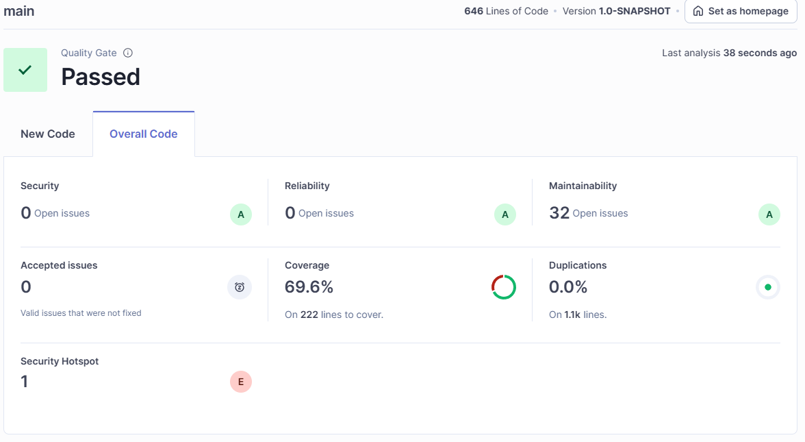
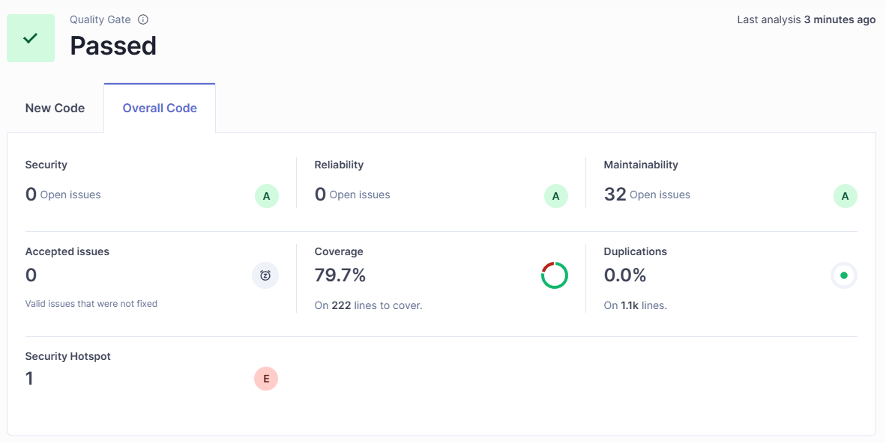

# Technische Schuld und Maßnahmen zur Reduzierung

Für die Analyse unserer Code-Metriken haben wir **SonarQube** eingesetzt. Die **Test-Coverage** haben wir mit **JaCoCo**
überprüft.

Beim **ersten Testdurchlauf** lag die Test-Coverage bereits bei **69 %**, wie in der folgenden Abbildung zu sehen ist:

**Erster SonarQube-Testlauf:**



Die vergleichsweise hohe Coverage lässt sich vor allem durch den Einsatz von **Test-Driven Development (TDD)** bei der
Entwicklung von **Klassen** und **Value Objects** erklären.

## Auffälligkeiten und Maßnahmen

Die Analyse hat allerdings gezeigt, dass insbesondere die **REST-Controller** noch viele *uncovered lines* hatten.
Um die Test-Coverage gezielt zu erhöhen, haben wir (u. a. auf Basis von LLM-Vorschlägen) **Tests mit Mock-Objekten** für
die REST-Controller erstellt. Nach der Umsetzung dieser Maßnahmen lag die Coverage bereits nahe am Zielwert von **80 %**:



## Maintainability und Codequalität

Auch die **Maintainability** war bereits mit **A** bewertet, dennoch hat SonarQube **32 potenzielle Verbesserungen**
vorgeschlagen. Dabei handelte es sich überwiegend um unkomplizierte Änderungen, zum Beispiel:

- Entfernen ungenutzter Variablen
- Vermeiden von Bad Practices (z. B. `System.out.println` statt eines Loggers)
- Gecatchte Exceptions sinnvoll weiterbehandeln (mindestens **loggen**)
- Keine generischen `throws Exception` verwenden, sondern **konkrete Exceptions** werfen
- Wiederkehrende Fehlertexte als **Konstanten** auslagern (statt an mehreren Stellen ähnliche Strings zu duplizieren)
- …

Das LLM hat uns dabei geholfen, diese Vorschläge schnell und sinnvoll in konkrete Code-Änderungen zu übertragen.

## Beispiel für eine Verbesserung durch SonarQube
SonarQube hat ein Code-Duplikat erkannt. Zuvor existierten zwei Methoden zur Anzeige einer Fehler- bzw. Erfolgsmeldung. Der Methodenkörper war in beiden Fällen identisch; der einzige Unterschied bestand in der Art der Meldung. Damit wurde das DRY-Prinzip berücksichtigt. Dies ist in dem folgenden Codeabschnitt zu sehen.
```java
private void showErrorAlert(String fehlermeldung) {
    Alert alert = new Alert(AlertType.ERROR);
    alert.setTitle("Fehler");
    alert.setHeaderText(null);
    alert.setContentText(fehlermeldung);
    alert.showAndWait();
}

private void showSuccessAlert(String meldung) {
    Alert alert = new Alert(AlertType.INFORMATION);
    alert.setTitle("Erfolg");
    alert.setHeaderText(null);
    alert.setContentText(meldung);
    alert.showAndWait();
}
```

Mithilfe von ChatGPT konnte dieses Duplikat entfernt werden. Nun existiert nur noch eine Methode, bei der alle relevanten Werte über Parameter konfigurierbar sind. Dadurch ist der Code übersichtlicher und besser wartbar. Die Verbesserung wird im folgenden Codeabschnitt dargestellt.
```java
private void showAlert(String title, String message, AlertType type) {​
    Alert alert = new Alert(type);​
    alert.setTitle(title);​
    alert.setHeaderText(null);​
    alert.setContentText(message);​
    alert.showAndWait();​
}
```

## Einfluss des Frontends auf die Test-Coverage

Nach dem Hinzufügen der **Frontend-Komponenten** ist die Test-Coverage zunächst deutlich gesunken, da wir während der
Frontend-Entwicklung nicht direkt daran gedacht haben, auch dort Unit-Tests zu schreiben. Gerade in diesem Bereich war
das LLM erneut hilfreich, weil es passende Testansätze vorgeschlagen und uns bei der Umsetzung unterstützt hat.


# Erfahrungen mit Metriken und dem LLM

Es war das erste Mal, dass wir in einem Softwareprojekt ein Tool zur Messung von Code-Metriken eingesetzt haben. Wir
haben sehr schnell gemerkt, wie wertvoll das ist. Gerade um sich zügig einen Überblick über offene Baustellen zu
verschaffen, war SonarQube extrem hilfreich. Besonders die Maintainability-Hinweise haben uns dabei unterstützt,
problematischen Code früh zu erkennen und gezielt zu verbessern. Insgesamt hat uns das so überzeugt, dass wir solche
Metrik-Tools künftig auch in weiteren Projekten nutzen möchten, um die Codequalität von Anfang an systematisch
hochzuhalten.

Ein LLM haben wir in diesem Kontext weniger genutzt, um direkte Vorschläge zur Reduzierung technischer Schuld zu
bekommen, weil SonarQube diesen Teil bereits sehr gut abdeckt. Außerdem ist es aktuell noch vergleichsweise umständlich,
ein LLM für solche Analysen einzusetzen: Damit es sinnvolle Maßnahmen ableiten kann, muss man ihm erst einen
ausreichenden Überblick über die bestehende Codebasis geben, was in der Praxis oft viel Copy & Paste bedeutet. Trotzdem
hat uns das LLM sehr geholfen, die Maintainability-Vorschläge schneller umzusetzen und dadurch die technische Schuld
insgesamt zügig zu reduzieren.

### Unterstützung bei der Test Coverage

Auch beim Erhöhen der **Test Coverage** war das LLM eine große Hilfe. Vor diesem Projekt hatte niemand aus unserem Team
wirklich Erfahrung damit, welche Arten von **Unit-Tests** sich für **Frontend-Komponenten** eignen und wie man sie
sauber
umsetzt. Das LLM hat uns hier unterstützt, indem es passende Testansätze vorgeschlagen, Beispiele geliefert und die
jeweiligen Konzepte verständlich erklärt hat. Dadurch konnten wir schneller sinnvolle Tests erstellen und die Coverage
gezielt verbessern.

### Clean Code Development
In unserem Projekt haben wir versucht, mehrere Prinzipien des *Clean Code Development* umzusetzen. Dazu zählen unter anderem:
- Checkstyle mit Code-Style-Standard von Google (Vorteil: einheitlicher und lesbarer Code)
- Magic-Numbers vermeiden (Vorteil: bessere Lesbarkeit und Wartbarkeit)
```java
private static final int MIN_NAME_LENGTH = 3;
```
- TODO-Tags im Code verwenden (Vorteil: bessere Kommunikation, Gedächtnisstütze)
```java
// TODO: registerCitizen implementieren
```