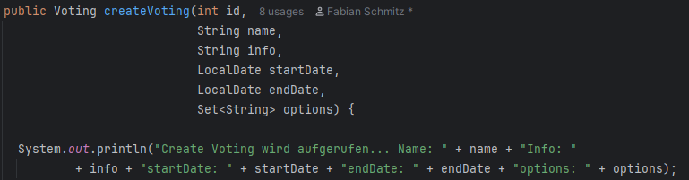
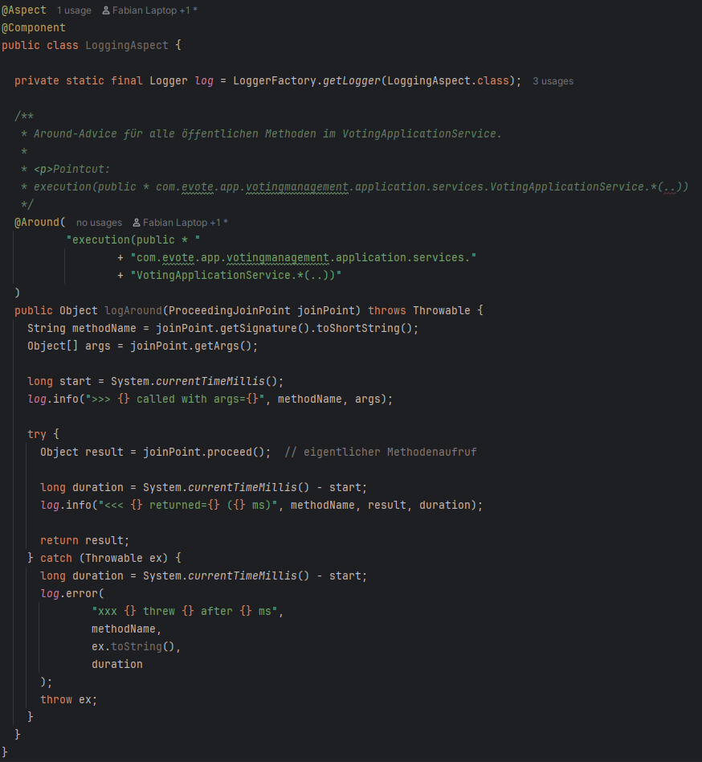
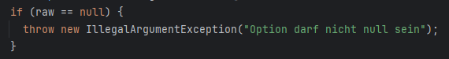
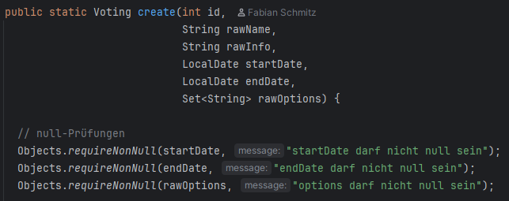
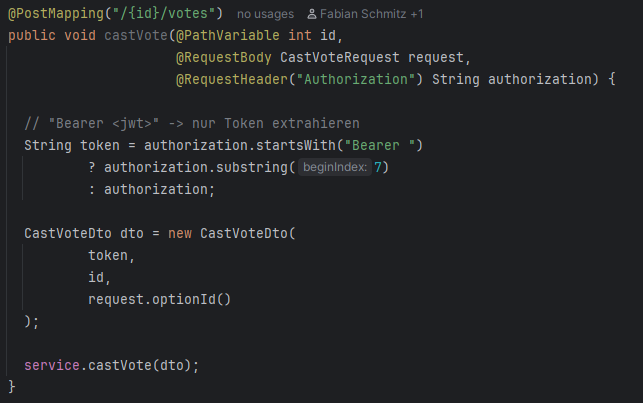
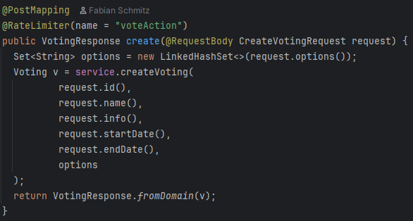

# AOP Analyse

## 1) Überblick: Cross-cutting Concerns

In unserem Projekt lassen sich mehrere **Querschnittsbelange (Cross-cutting Concerns)** identifizieren. Damit sind
Funktionalitäten gemeint, die in vielen Klassen auftreten, aber **nicht** zur eigentlichen Fachlogik gehören (z.B.
Logging, Security, Fehlerbehandlung). AOP eignet sich, um solche Belange **zentral** zu implementieren und den Code in
den Fachklassen schlank zu halten.

---

## 2) Logging als Querschnittsbelang (umgesetzt)

Ein typisches Beispiel in unserem Projekt ist das **Logging von Methodenaufrufen**. Zum Debugging ist es hilfreich, bei
jedem Aufruf **Methodennamen, Parameter, Rückgabewerte, Laufzeiten und Exceptions** zu protokollieren, statt dies in
jeder Methode manuell zu wiederholen.

Dafür verwenden wir einen **Aspect (`LoggingAspect`)** mit einem **Around-Advice**, der alle öffentlichen Methoden des
`VotingApplicationService` umschließt und Laufzeit sowie Fehlerfälle protokolliert. Dadurch bleibt die Fachlogik im
Service übersichtlich, während das Logging zentral konfiguriert ist.

**Beispiel (vorher):**

**Unser LoggingAspect:**

---

## 3) Null-Prüfungen & Inputvalidierung (bewusst nicht per AOP)

Ein weiteres wiederkehrendes Thema sind **Null-Prüfungen** am Anfang von Methoden oder Konstruktoren. Solche Checks
wirken zunächst wie ein potenzieller AOP-Kandidat, sind in unserem Fall aber teilweise Teil der **Domäneninvarianten**.

Insbesondere in den **Value Objects** (z.B. `VotingName`, `VotingInfo`, `OptionLabel`) sichern die Prüfungen die
korrekte Erstellung von Objekten ab. Deshalb bleiben diese Prüfungen bewusst in der Domain, um sicherzustellen, dass
ungültige Domain-Objekte **unabhängig von der Aufrufstelle** (REST, UI, Tests) nicht erzeugt werden können.

**Null-Prüfuung in einem Value Objekt:**

**Null-Prüfung in der Voting Klasse:**

---

## 4) Authentifizierung / Token-Handling (potenzieller AOP-Fall)

Ein weiteres potenzielles AOP-Anwendungsfeld ist die **Authentifizierung**. Im `VotingRestController` muss der JWT aus
dem `Authorization`-Header extrahiert werden („Bearer …“). Diese Token-Extraktion ist eine wiederholende, technische
Aufgabe und eignet sich grundsätzlich für zentrale Mechanismen (z.B. **Filter/Interceptor** oder AOP).

In unserem Projekt haben wir uns stattdessen für eine **Helper-Methode** entschieden, da sie für den Prototypen
einfacher und transparenter ist.

---

## 5) Rate Limiting mit Resilience4j (Annotation-basiert, AOP-ähnlich)

Zusätzlich nutzen wir **Resilience4j Rate Limiting**, das intern ebenfalls AOP-Mechanismen verwendet. Per `@RateLimiter`
-Annotation kann die Anzahl von Aufrufen pro Zeitraum begrenzt werden, um den Server vor Überlastung zu schützen.

---

## LLM-Einsatz-Dokumentation

Das LLM hat uns besonders bei der **Analyse** unterstützt, um sinnvolle AOP-Einsatzmöglichkeiten im Projekt zu
identifizieren.  
Bei der Implementierung des **Rate Limiters** hatten wir zunächst überlegt, eine eigene Lösung zu schreiben. Das LLM hat
uns jedoch auf das Framework **Resilience4j** hingewiesen. Wir haben uns anschließend bewusst dafür entschieden, da es
sinnvoll ist, auf **bewährte und etablierte Bibliotheken** zurückzugreifen, statt eine eigene Lösung zu bauen.

Auch die Implementierung unseres **LoggingAspects** (inkl. Around-Advice, Laufzeitmessung und Exception-Logging) konnten
wir mit Unterstützung des LLMs ohne größere Probleme umsetzen.

Wir hatten uns überlegt, die Null-Prüfungen aus den Klassen und Value Objects zu entfernen und mittels AOP zu
zentralisieren. Das LLM hat uns darauf hingewiesen, diese Prüfungen **in den Klassen bzw. Value Objects** zu belassen,
da sie zur Sicherung von Invarianten beitragen und Domain-Objekte so unabhängig von der Aufrufstelle (REST, UI, Tests)
konsistent bleiben.

An dieser Stelle sind wir uns selbst noch nicht vollständig sicher, ob das langfristig die beste Entscheidung ist:

- **Fachliche Validierung** (z.B. „wie muss ein Voting-Name aussehen?“) sollte klar in den **Value Objects** verbleiben.
- **Einfache Null-Prüfungen** könnten aus unserer Sicht theoretisch auch zentralisiert werden (z.B. über AOP an
  Schichtgrenzen).

Wir haben uns vorerst dafür entschieden, den aktuellen Stand beizubehalten. Ggfs. werden wir die Null-Prüfungen zu einem
späteren Zeitpunkt noch zentralisieren. Insgesamt hat das LLM außerdem mehrere sinnvolle Vorschläge für weitere
AOP-Anwendungsfälle geliefert.
