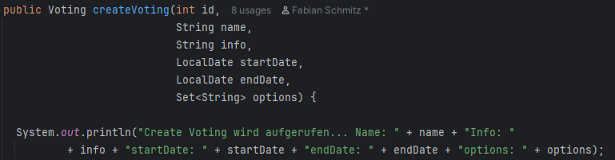
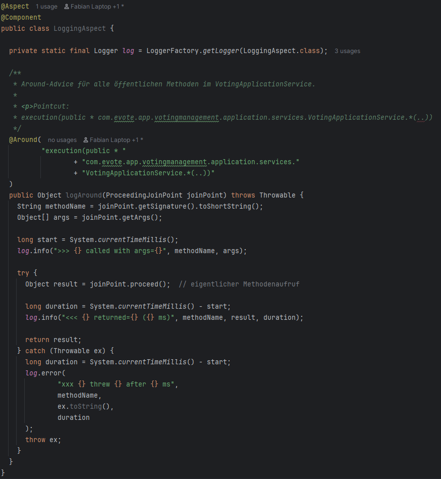
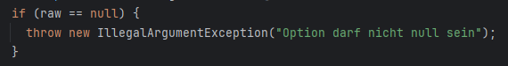
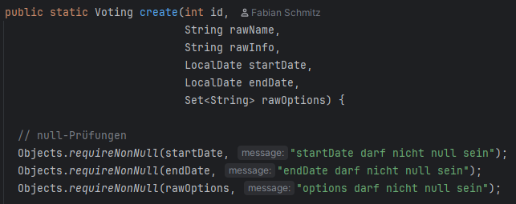
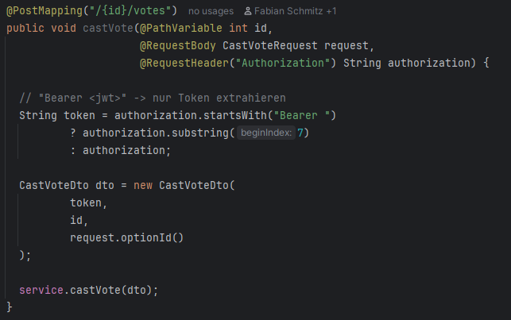
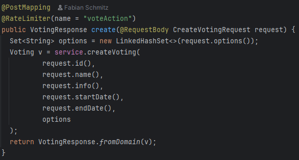

# AOP Analyse

## Grundlagen zu AOP

### Prinzip von AOP
- Separation of concerns: Klassen und Methoden sollen nur das tun, wofür sie verantwortlich sind

### Vorteile von AOP
- Sauberer Code (Methode erfüllt nur ihre Kernfunktionalität)
- bessere Lesbarkeit
- bessere Wartbarkeit
- Wiederverwendbarkeit
- keine Duplikate

### Nachteile von AOP
- erschwertes Debugging
- für die Entwickler ist nicht mehr sichtbar, das etwas passiert und was überhaupt passiert

### Anwendungsgebiete von AOP
- Performance-Test
- Security
- Logging
- Testen

### Aspekt
- ein Codestück bzw. dessen Aufgabe, die es zu erledigen gilt (= Concern)
- **Code-Level-Concerns:** Kernfunktionalität (funktionale Anforderungen)
- **System-Level-Concerns:** sonstige Funktionalität (nicht-funktionale Anforderungen)

### Cross-cutting Concerns
- Querschnittsfunktionalitäten, die sich durch viele Teile einer Anwendung ziehen, aber nicht zur eigentlichen Fachlogik gehören
- erzeugen echte Modularität

### Advice
- der auszuführende Code (System-Level-Concern), der in die Core-Level Methode hineingewoben wird
- **Before:** Wird vor einem Join Point ausgeführt
- **After:** Wird nach einem Join Point ausgeführt (unabhängig davon, ob er erfolgreich war oder eine Exception geworfen hat)
- **Around:** Umschließt den Join Point und kann dessen Ausführung kontrollieren, verzögern, verändern oder sogar ersetzen

### Pointcut
- Definition der Orte, an denen tatsächlich hineingewoben wird

### Join-Point
- konkrete Punkt, an dem das Aufrufereignis stattfindet

### Weaving
- Vorgang des Hineinwebens der fachfremden Concerns in den Zielcode

## 1) Überblick: Cross-cutting Concerns

In unserem Projekt lassen sich mehrere **Querschnittsbelange (Cross-cutting Concerns)** identifizieren. Damit sind
Funktionalitäten gemeint, die in vielen Klassen auftreten, aber **nicht** zur eigentlichen Fachlogik gehören (z.B.
Logging, Security, Fehlerbehandlung). AOP eignet sich, um solche Belange **zentral** zu implementieren und den Code in
den Fachklassen schlank zu halten.

---

## 2) Logging als Querschnittsbelang (umgesetzt)

Ein typisches Beispiel in unserem Projekt ist das **Logging von Methodenaufrufen**. Zum Debugging ist es hilfreich, bei
jedem Aufruf **Methodennamen, Parameter, Rückgabewerte, Laufzeiten und Exceptions** zu protokollieren, statt dies in
jeder Methode manuell zu wiederholen.

Dafür verwenden wir einen **Aspect (`LoggingAspect`)** mit einem **Around-Advice**, der alle öffentlichen Methoden des
`VotingApplicationService` umschließt und Laufzeit sowie Fehlerfälle protokolliert. Dadurch bleibt die Fachlogik im
Service übersichtlich, während das Logging zentral konfiguriert ist.

**Beispiel (vorher):**



**Unser LoggingAspect:**



---

## 3) Null-Prüfungen & Inputvalidierung (bewusst nicht per AOP)

Ein weiteres wiederkehrendes Thema sind **Null-Prüfungen** am Anfang von Methoden oder Konstruktoren. Solche Checks
wirken zunächst wie ein potenzieller AOP-Kandidat, sind in unserem Fall aber teilweise Teil der **Domäneninvarianten**.

Insbesondere in den **Value Objects** (z.B. `VotingName`, `VotingInfo`, `OptionLabel`) sichern die Prüfungen die
korrekte Erstellung von Objekten ab. Deshalb bleiben diese Prüfungen bewusst in der Domain, um sicherzustellen, dass
ungültige Domain-Objekte **unabhängig von der Aufrufstelle** (REST, UI, Tests) nicht erzeugt werden können.

**Null-Prüfuung in einem Value Objekt:**



**Null-Prüfung in der Voting Klasse:**



---

## 4) Authentifizierung / Token-Handling (potenzieller AOP-Fall)

Ein weiteres potenzielles AOP-Anwendungsfeld ist die **Authentifizierung**. Im `VotingRestController` muss der JWT aus
dem `Authorization`-Header extrahiert werden („Bearer …“). Diese Token-Extraktion ist eine wiederholende, technische
Aufgabe und eignet sich grundsätzlich für zentrale Mechanismen (z.B. **Filter/Interceptor** oder AOP).

In unserem Projekt haben wir uns stattdessen für eine **Helper-Methode** entschieden, da sie für den Prototypen
einfacher und transparenter ist.



---

## 5) Rate Limiting mit Resilience4j (Annotation-basiert, AOP-ähnlich)

Zusätzlich nutzen wir **Resilience4j Rate Limiting**, das intern ebenfalls AOP-Mechanismen verwendet. Per `@RateLimiter`
-Annotation kann die Anzahl von Aufrufen pro Zeitraum begrenzt werden, um den Server vor Überlastung zu schützen.



---

## 6) AOP beim CitizenManagement

ChatGPT hat mir mehrere Vorschläge gemacht, wie AOP im Projekt eingesetzt werden könnte. Dazu gehörten unter anderem:
- AOP beim erfolgreichen oder nicht erfolgreichen Login
- AOP bei der erfolgreichen oder nicht erfolgreichen Registrierung
- Rate Limiting bzw. Brute-Force-Schutz beim Login

Ich habe mich entschieden, AOP beim Login umzusetzen, da sich dieses Beispiel gut eignet, um das Grundkonzept von AOP zu verstehen. Der grundlegende Code für diese Lösung wurde von ChatGPT erzeugt. Anschließend habe ich den Code selbst überarbeitet und an meine Bedürfnisse angepasst. Dabei habe ich unter anderem:
- den Methodennamen zur Log-Ausgabe hinzugefügt,
- Kommentare ergänzt, um den Code besser verständlich zu machen,
- sowie ternäre Operatoren durch normale if-else-Anweisungen ersetzt, da diese für mich leichter lesbar sind.

```java
@AfterReturning(
            pointcut = "execution(boolean com.evote.app.citizen_management.application.services.CitizenService.loginCitizen(..))",
            returning = "success"
    )
    public void logLoginAttempt(JoinPoint joinPoint, boolean success) {

        Object[] args = joinPoint.getArgs();
        String email;
        String methodName = joinPoint.getSignature().getName();

        if (args != null && args.length > 0) {
            email = String.valueOf(args[0]);
        } else {
            email = "unknown";
        }

        if (success) {
            log.info("Methode {}: Login erfolgreich (email={})", methodName, email);
        } else {
            log.warn("Methode {}: Login fehlgeschlagen (email={})", methodName, email);
        }
    }
```

Im Anschluss habe ich die Implementierung getestet. Dabei wurden bei fehlgeschlagenem und erfolgreichem Login entsprechende Log-Ausgaben in der Konsole erzeugt:
- 2026-01-06T13:56:24.793+01:00  WARN 82242 --- [nio-8080-exec-1] c.e.a.c.i.aspects.LoggingAspectCitizen   : Methode loginCitizen: Login fehlgeschlagen (email=ddsa@dsd.de)
- 2026-01-06T13:58:49.877+01:00  INFO 82242 --- [nio-8080-exec-4] c.e.a.c.i.aspects.LoggingAspectCitizen   : Methode loginCitizen: Login erfolgreich (email=lydia@email.de)

---

## LLM-Einsatz-Dokumentation

Das LLM hat uns besonders bei der **Analyse** unterstützt, um sinnvolle AOP-Einsatzmöglichkeiten im Projekt zu
identifizieren.  
Bei der Implementierung des **Rate Limiters** hatten wir zunächst überlegt, eine eigene Lösung zu schreiben. Das LLM hat
uns jedoch auf das Framework **Resilience4j** hingewiesen. Wir haben uns anschließend bewusst dafür entschieden, da es
sinnvoll ist, auf **bewährte und etablierte Bibliotheken** zurückzugreifen, statt eine eigene Lösung zu bauen.

Auch die Implementierung unseres **LoggingAspects** (inkl. Around-Advice, Laufzeitmessung und Exception-Logging) konnten
wir mit Unterstützung des LLMs ohne größere Probleme umsetzen.

Wir hatten uns überlegt, die Null-Prüfungen aus den Klassen und Value Objects zu entfernen und mittels AOP zu
zentralisieren. Das LLM hat uns darauf hingewiesen, diese Prüfungen **in den Klassen bzw. Value Objects** zu belassen,
da sie zur Sicherung von Invarianten beitragen und Domain-Objekte so unabhängig von der Aufrufstelle (REST, UI, Tests)
konsistent bleiben.

An dieser Stelle sind wir uns selbst noch nicht vollständig sicher, ob das langfristig die beste Entscheidung ist:

- **Fachliche Validierung** (z.B. „wie muss ein Voting-Name aussehen?“) sollte klar in den **Value Objects** verbleiben.
- **Einfache Null-Prüfungen** könnten aus unserer Sicht theoretisch auch zentralisiert werden (z.B. über AOP an
  Schichtgrenzen).

Wir haben uns vorerst dafür entschieden, den aktuellen Stand beizubehalten. Ggfs. werden wir die Null-Prüfungen zu einem
späteren Zeitpunkt noch zentralisieren. Insgesamt hat das LLM außerdem mehrere sinnvolle Vorschläge für weitere
AOP-Anwendungsfälle geliefert.
