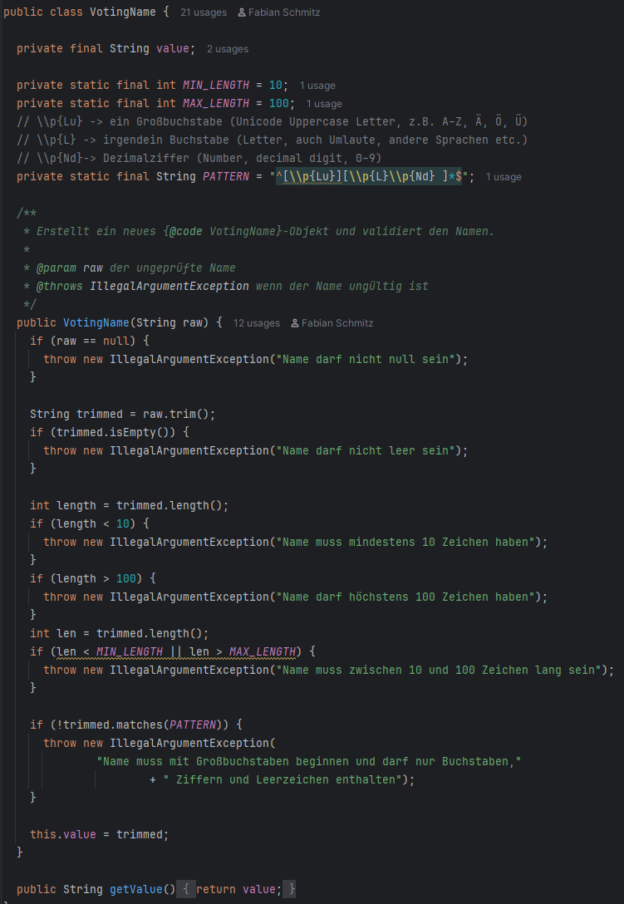
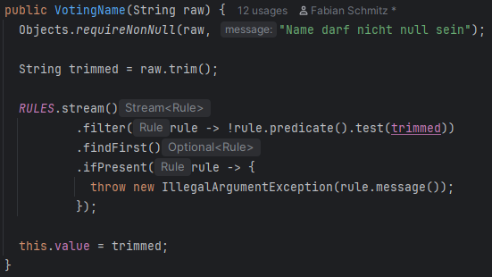
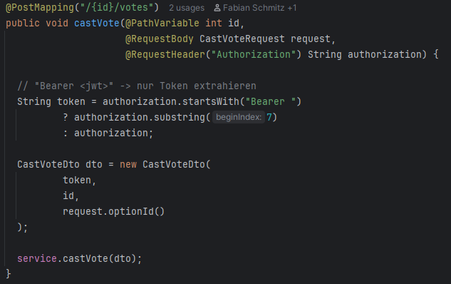
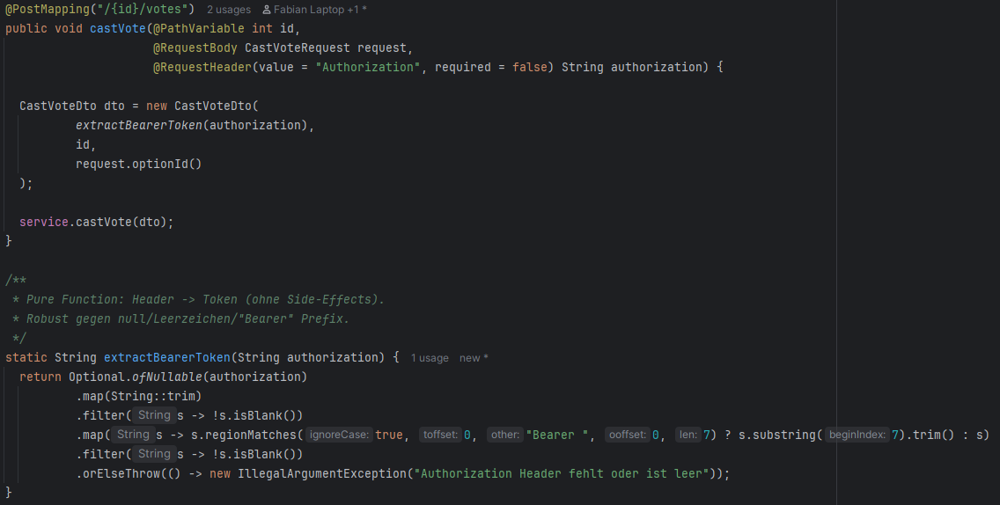
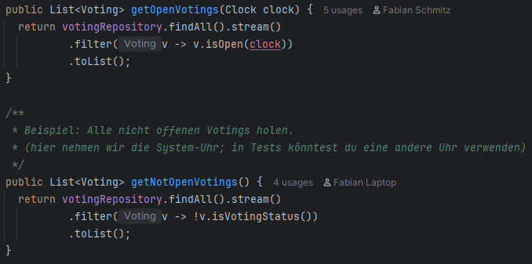
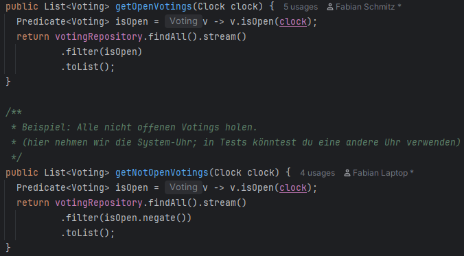
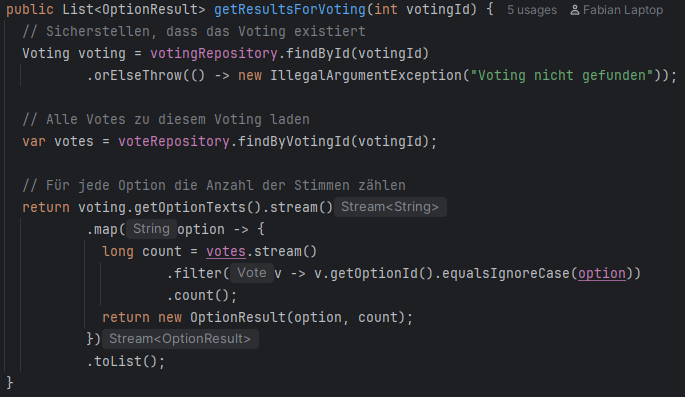
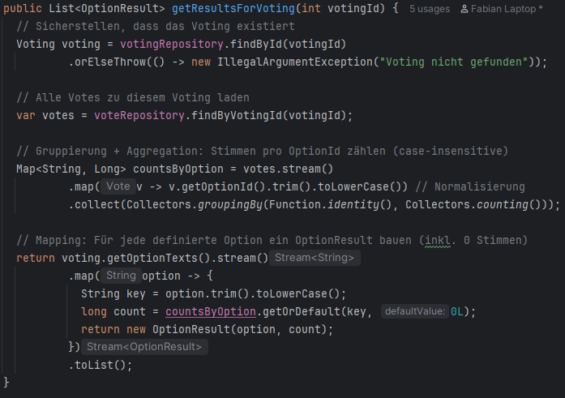

# Analyse des eigenen Codes

## Validierungsregeln als Daten modellieren

Im ursprünglichen VotingName-Value-Object passiert die Validierung im Konstruktor über eine Kette von if-Abfragen.Der
Eingabestring wird auf null geprüft, getrimmt, auf Leerheit geprüft und anschließend validiert (Länge, Pattern). Bei der
ersten Regelverletzung wird sofort eine IllegalArgumentException geworfen (
fail-fast). Dabei steckt die gesamte Logik als Kaskade im Konstruktor und es gibt sogar redundante Prüfungen (die Länge
wird doppelt geprüft), was Wartung und Erweiterung unnötig fehleranfällig macht.

In der überarbeiteten Version werden die Validierungsregeln als “Daten” modelliert: eine Liste aus Regeln, die jeweils
aus einem Predicate<String> (reine Prüf-Funktion) und einer Fehlermeldung bestehen. Der Konstruktor normalisiert nur
einmal (trim) und wendet dann deklarativ per Stream die Regeln an, indem die erste fehlschlagende Regel gesucht und
deren Fehlermeldung geworfen wird. Das bringt vor allem bessere Wartbarkeit und Lesbarkeit (Regeln sind zentral
definiert, Konstruktor bleibt schlank), reduziert Redundanz, erleichtert Tests einzelner Regeln und macht spätere
Erweiterungen (z.B. neue Regel hinzufügen) sehr unkompliziert, ohne den Konstruktor weiter aufzublähen.

## Token-Verarbeitung als pure Funktion kapseln

Im aktuellen castVote-Endpoint wird das Authorization-Header-Parsing direkt im Controller gemacht: Es wird
geprüft, ob der Header mit "Bearer " beginnt, und dann per substring(7) der Token extrahiert, ansonsten wird der Header
unverändert verwendet. Diese Logik ist zwar kurz, steckt aber als “Spezialfall” im Controller, ist nicht null-robust und
schwerer isoliert zu testen, weil sie nur indirekt über den Endpoint getestet wird.

In der Überarbeitung wird das Parsing in eine pure Funktion ausgelagert, die den Header deterministisch in einen Token
transformiert (trimmen, optional Prefix entfernen, leere Werte abweisen).
Der Controller baut dann nur noch das CastVoteDto und delegiert an den Service. Dadurch wird der Controller
schlanker und klarer, das Token-Handling ist wiederverwendbar und separat testbar, und typische Edgecases (fehlender
Header, zusätzliche Leerzeichen, leere Tokens) werden konsistent und können separat getestet werden.

## Filterlogik als Predicate ausdrücken

Im ursprünglichen Code wurden offene und nicht offene Votings jeweils direkt über Inline-Lambdas im Stream gefiltert.
Die Filterlogik war dadurch zwar kurz, aber fachlich nicht ganz konsistent (für „open“ wurde eine Methode mit Uhr
verwendet, für „not-open“ nur ein Status-Flag) und die Regeln waren nicht als eigene, benannte Einheit erkennbar. Man
musste vorher die Bedeutung aus den Lambdas herauslesen.

In der Überarbeitung wird die Filterbedingung als Predicate<Voting> explizit gemacht: isOpen beschreibt als benannte
Funktion die Fachregel „Voting ist aktuell offen (abhängig von der Uhr)“. Für „not-open“ wird das Gegenstück über
isOpen.negate() gebildet. Dadurch wird die Logik funktionaler, die Fachdefinition von „not-open“ ist konsistent zum
„open“-Kriterium, und der Code ist leichter zu lesen und zu testen. Das liegt daran, dass die Filterregel klar benannt
ist und nicht nur als Inline-Ausdruck in der Lambdafunktion existiert. Ein Nachteil ist eine duplizierte Code Zeile und
generell mehr LoC als vorher, was wir aber zwecks Lesbarkeit in Kauf genommen haben.

## Collection Processing

Im ursprünglichen getResultsForVoting werden die Stimmen pro Option berechnet, indem über alle im Voting definierten
Optionen iteriert wird. Dabei wird für jede Option erneut die komplette Vote-Liste gefiltert und gezählt. Das ist zwar
gut nachvollziehbar, führt aber zu mehrfacher Iteration über dieselben Daten (für jede Option einmal) und nutzt keine
expliziten funktionalen Sammeloperationen wie Gruppierung oder Aggregation.

In der überarbeiteten Version wird die Vote-Liste einmalig per Stream verarbeitet und mittels groupingBy und counting zu
einer Map “Option → Stimmenanzahl” aggregiert. Anschließend wird diese Aggregation wieder auf die definierte
Optionsliste gemappt, sodass alle Optionen (auch solche mit 0 Stimmen) als OptionResult ausgegeben werden. Dadurch wird
der Code funktionaler (explizite Gruppierung/Aggregation, klare Transformationen), effizienter (nur ein Durchlauf über
die Votes) und leichter erweiterbar.

# Reflexion

Wir als Gruppe sind alle durch das Grundstudium durchaus mit Java vertraut, haben bisher aber kaum richtige
Softwareprojekte damit umgesetzt. Komplexere Java-Funktionen (Streams, Maps, Gruppierungen etc.) sind uns deshalb zwar
bekannt, aber für uns deutlich schwieriger zu lesen als einfache if-Statements. Die Nachteile der funktionalen
Programmierung waren für uns also eindeutig die komplexere Lesbarkeit aufgrund des fortschrittlicheren Codes. Vorteile
der funktionalen Implementierung sind häufig, dass der Code effizienter ausgeführt wird, wie beim Collection Processing,
und dass Methoden oft verschlankt werden können.

Wir haben den Code mittels ChatGPT 5.2 analysieren lassen, um Code-Stellen zu identifizieren, die von funktionaler
Programmierung profitieren würden. Ebenfalls hat ChatGPT dabei geholfen, Vorschläge für funktionale Programmierung an
diesen Stellen zu machen. Wir haben dabei nicht alle Stellen, die ChatGPT vorgeschlagen hat, umgesetzt, da dies
teilweise zu Kompromissen an anderen Stellen geführt hätte (z.B. dass Code-Doppelungen auftreten). ChatGPT wurde
ebenfalls dazu verwendet, schwierige Code-Abschnitte im Detail zu erklären.

Allgemein kann man sagen, dass sich die Codequalität und Effizienz unseres Codes durch FP stark verbessert hat. Bei der
Lesbarkeit hängt es tatsächlich stark vom Leser ab, inwiefern sich die Lesbarkeit verbessert. Für einen erfahrenen
Java-Entwickler werden die umgesetzten Maßnahmen die Lesbarkeit deutlich verbessert haben. Für den Laien eher
verschlechtert, aufgrund der komplexeren Funktionen.

Herausforderungen bei der Umsetzung waren vor allem, das Konzept hinter funktionaler Programmierung wirklich zu
verstehen und es korrekt auf unseren bestehenden Code anzuwenden. Zusätzlich war es für uns nicht immer offensichtlich,
welche Refactorings „nur schöner“ sind und welche tatsächlich einen Mehrwert bringen, ohne dabei andere Nachteile zu
erzeugen. Außerdem war es teilweise herausfordernd, funktionale Änderungen mit bestehenden Tests und der UI-Ausgabe
abzugleichen, weil sich Verhalten (z.B. Fehlermeldungs-Handling) indirekt ändern kann, wenn man Logik umstrukturiert.

Lessons Learned für uns ist, dass es sich lohnen kann, funktionale Programmierung umzusetzen, da dies viele Vorteile
haben kann, siehe oben, auch wenn es zunächst anstrengend ist, den Code zu lesen. Gleichzeitig hilft es dem eigenen
Code-Selbstbewusstsein, solche Stellen in den eigenen Code einzubauen und wirklich zu verstehen.