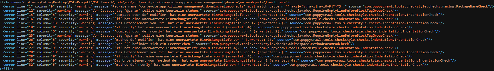
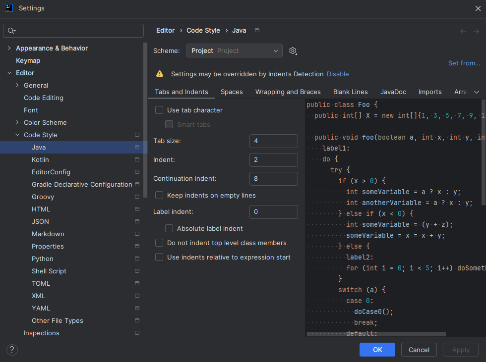

# Checkstyle – so nutzen wir es im Projekt

Damit unser Code einigermaßen einheitlich aussieht, verwenden wir **Checkstyle** mit dem
**Google Java Style**.

---

## Welcher Standard wird verwendet?

In der `pom.xml` ist das Maven-Plugin so konfiguriert:

- **Plugin:** `maven-checkstyle-plugin`
- **Regelset:** `google_checks.xml`  
  → das ist der offizielle **Google Java Style Guide**

Das Plugin läuft automatisch in der Maven-Phase `verify` und damit auch in der CI/CD-Pipeline.

---

## Verhalten in der CI/CD-Pipeline

Wichtig:

- Checkstyle unterscheidet **Severity-Stufen**: `info`, `warning`, `error`.
- Unsere aktuelle Konfiguration:
    - **Warnings** → werden nur als Warnungen im Log angezeigt  
       **Pipeline läuft trotzdem GRÜN weiter.**
    - **Errors** → zählen als Verstoß  
       **Pipeline schlägt fehl** (Merge nach `main` ist dann blockiert).

Kurz:

> **Warnungen sind unschön, aber ihr dürft trotzdem pushen.  
> Fehler („error“) blockieren den Build und müssen gefixt werden.**


---

## Checkstyle lokal ausführen

Damit ihr nicht erst auf GitHub warten müsst, könnt ihr Checkstyle lokal laufen lassen.

Im Projektordner `code/app`:

```bash
mvn clean verify
```

Im Dokument `target/checkstyle-result.xml` stehen dann die Hinweise und Errors.



---

## IntelliJ: Einrückung auf 2 statt 4 Spaces stellen

Der Google-Style verwendet eine **2-Space-Einrückung**, IntelliJ standardmäßig **4**.  
Damit Checkstyle nicht ständig wegen „Indentation“ meckert, stellt euch IntelliJ entsprechend um:

### 1. Settings öffnen

- **Windows/Linux:** `File → Settings…`
- **macOS:** `IntelliJ IDEA → Preferences…`

### 2. Code Style anpassen

1. Navigiert zu: `Editor → Code Style → Java`
2. Wechselt auf den Tab **„Tabs and Indents“**.
3. Setzt folgende Werte:

    - **Indent:** `2`
    - **Continuation indent:** `4`  
      (oder ebenfalls `2`, je nach Geschmack – wichtig ist `Indent = 2`)
    - **Tab size:** `2`
    - **Use tab character:** **Haken entfernen** (wir nutzen Spaces, keine Tabs)

4. Mit **Apply** / **OK** bestätigen.



---

## Alle Dateien im eigenen Bounded Context neu einrücken

Wenn ihr in eurem Bounded Context (z.B. `voting_management` oder `vote_management`) einmal alles
sauber formatiert wollt:

### Variante 1: Über das Kontextmenü

1. Im **Project-View** in IntelliJ den Ordner eures Bounded Contexts auswählen, z.B.:

   ```text
   src/main/java/com/evote/app/voting_management


1. Rechtsklick auf den Ordner.
2. **„Reformat Code…“** auswählen.
3. Im Dialog:
    - Haken bei **„Include subdirectories“** setzen.
    - Optional: Haken bei **„Optimize imports“** setzen.
4. Mit **„Run“** bestätigen.

Danach sollten die Einrückungen zu euren 2-Space-Einstellungen passen und viele
Checkstyle-„Indentation“-Warnungen verschwinden.